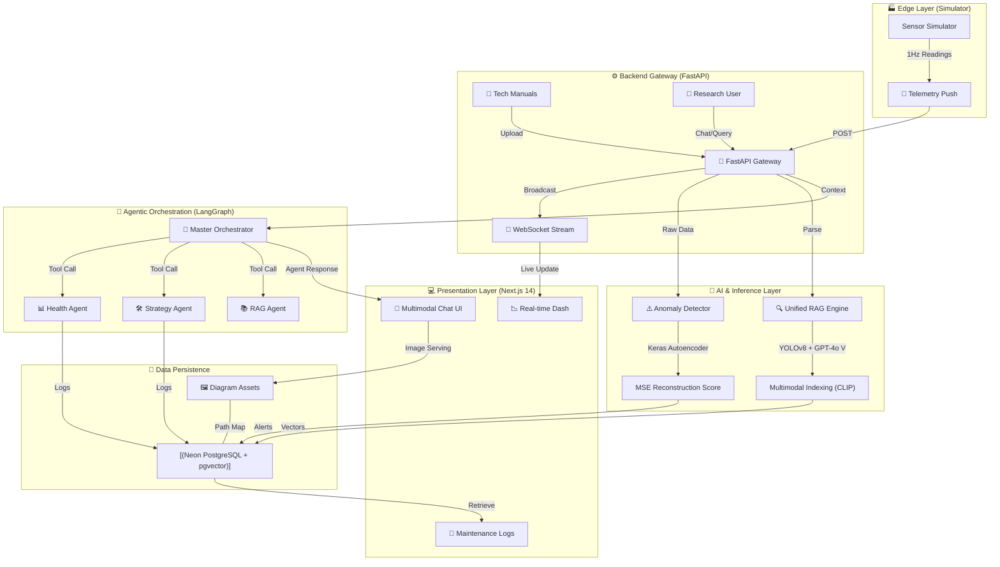
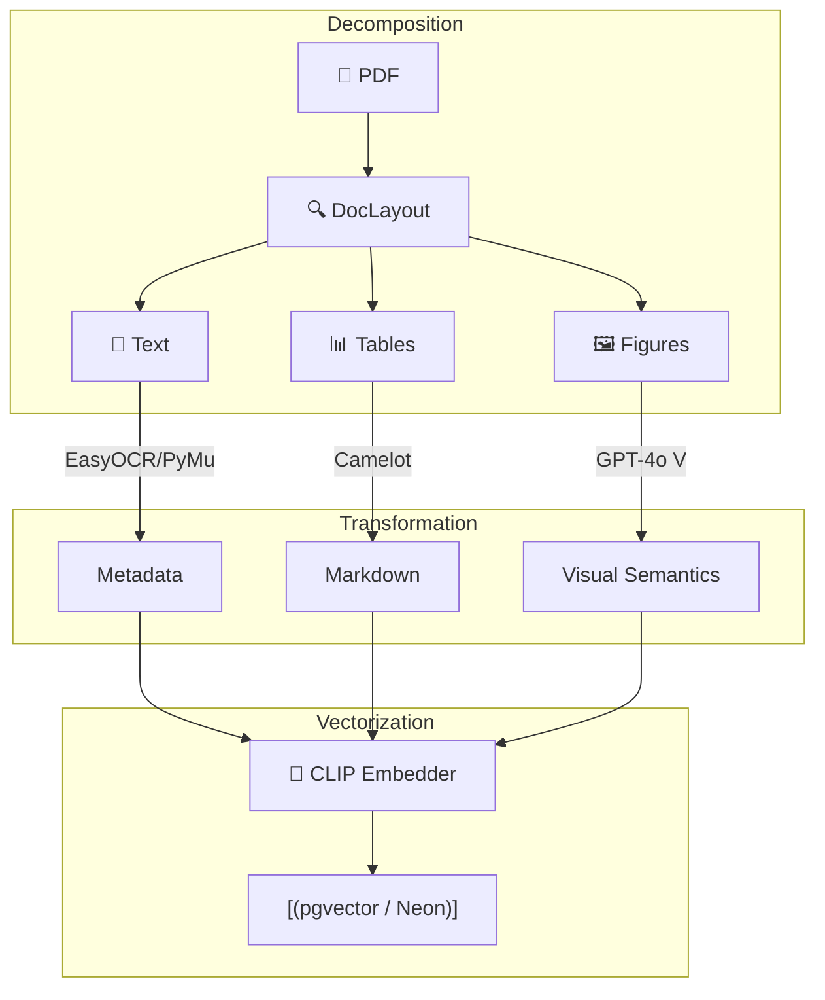

# 🏭 Industrial AI Copilot — System Launch Report (2026.03.22)

## 🌐 Unified System Architecture
Today marks the successful unification of the **Industrial AI Copilot** research framework. This system integrates high-frequency sensor telemetry, deep-learning based anomaly detection, and a state-of-the-art multimodal agentic RAG.

---

## 📚 Multimodal Document processing
The system utilizes a specialized pipeline to transform dense technical manuals into actionable intelligence.

### 🏗️ Ingestion & Retrieval Pipeline

---

## 🚀 Research Breakthroughs & Stability
To reach this "System Launch" state, several critical technical hurdles were overcome today:

### 1. Batch-Commit Ingestion Strategy
**Problem**: Large PDF manuals (100+ pages, 1000+ images) were causing SSL connection timeouts on Neon DB during long-running embedding/vision tasks.
**Solution**: Implemented a **Batch-Commit logic** that performs high-latency AI tasks (Vision API, CLIP locally) in isolation and only opens short-lived DB sessions to commit 50-chunk batches.
**Result**: Verified ingestion of a 98-page manual (1343 chunks) with zero failures.

### 2. Autoencoder Model Restoration
**Problem**: Missing `autoencoder.keras` weights caused 500 errors in the telemetry loop.
**Solution**: Re-initialized the entire ML pipeline:
1. `generate_dataset.py`: 20k row sensor baseline.
2. `normalization.py`: StandardScaler fitting.
3. `train_model.py`: Training to convergence (Epoch 100).
**Result**: Real-time anomaly detection is now live and pushing alerts via WebSockets.

### 3. Frontend Hydration & UI Stability
**Fixes**: Standardized chart heights and implemented mounting guards to prevent Recharts/Hydration mismatch errors in Next.js 14.

---

## 🔬 Special Research Points: Industrial GenAI Frameworks

## 🔬 Special Research Notes: SOTA Multimodal RAG

This section synthesizes current state-of-the-art (SOTA) research and industrial benchmarks for Multimodal Retrieval-Augmented Generation, specifically applied to technical documentation and predictive maintenance.

### 1. Academic Foundations

#### ColPali: Efficient Document Retrieval with VLMs (2024)
*   **Core Concept**: Introduces "Vision-Language Model (VLM) only" retrieval.
*   **Breakthrough**: Bypasses the traditional, brittle pipeline of OCR -> Layout Detection -> Text Chunking. Instead, it embeds **screenshots** of document pages directly using a model like PaliGemma.
*   **Comparison**: While our project uses a "Caption-then-Embed" approach (GPT-4o + CLIP), ColPali moves toward "End-to-End Visual Retrieval." However, our approach is currently more robust for extracting structured data from complex tables (via Camelot), which ColPali can struggle to serialize for reasoning.

#### LAD-RAG: Layout-Aware Dynamic RAG
*   **Core Concept**: Captures the symbolic structure of a document (headers, sections, parent-child relationships) alongside neural embeddings.
*   **Our Alignment**: Our use of **YOLOv8-DocLayout** for region detection directly implements the "Layout-Awareness" required to prevent the loss of context (e.g., separating a caption from its diagram).

### 2. Industrial Case Studies & ROI Benchmarks

#### Hyundai Staria Maintenance (LoRA-Tuned Multimodal RAG)
*   **Context**: Hyundai developed a technical QA system for vehicle manuals.
*   **Results**: Successfully integrated text and image extraction. Noted an **18.03% improvement** in technical term accuracy and an expert satisfaction score of 4.4/5. 

#### MIT Root Cause Diagnosis Chatbot
*   **Context**: A generative AI system designed to aid technicians in manufacturing equipment repair.
*   **Outcome**: Reported a **30% reduction in diagnostic time**.

#### Additional Global Benchmarks
*   **Equipment Rental Sector**: Implementation of foundation models for maintenance led to **50% faster PDF searches** and a **78% relevance rate** in automated recommendations.
*   **Railway Troubleshooting**: Field tests showed railway technicians completed complex diagnostic tasks significantly faster using RAG-enabled assistants compared to traditional paper/PDF manuals.
*   **NVIDIA Enterprise RAG Blueprint**: Validates our architecture by emphasizing multimodal reasoning and visual-layout awareness as the "Gold Standard" for industrial documentation.

### 3. Alternative Research Frameworks
While our implementation is optimized for the **Industrial Copilot**, it draws inspiration from:
- **M3DocRAG**: Designed for multi-page, multi-document evidence retrieval across text, charts, and figures.
- **MultiRAG**: A framework focused on mitigating hallucinations in multi-source heterogeneous data environments.

### 4. Competitive Advantage of our Implementation
...

Our current architecture (FastAPI + CLIP + GPT-4o V + pgvector) positions us between traditional text-only RAG and emerging vision-only end-to-end models.

| Feature | Standard RAG | Our Framework | SOTA (ColPali/VDU) |
|---|---|---|---|
| **Text Parsing** | PyPDF | Layout-Aware (YOLOv8) | Page-Image Based |
| **Diagram Support** | None (Filtered) | **Caption-Enhanced** | Fully Visual |
| **Table Accuracy** | Low (Text Garbage) | **High (Lattice Parser)** | Variable |
| **Speed** | Fast | Moderate (Batch API) | Slow (Multi-vector) |

### 4. Significance of GenAI Research
GenAI research in the industrial sector is moving from "Chatting with Docs" to **"Operating with Insight."** 
1. **Closing the Knowledge Loop**: Bridging the 80% gap of industrial data that is unstructured (PDFs, Logs, Diagrams).
2. **Prescriptive Maintenance**: Shifting away from "Machine is broken" to "Machine is broken; here is Fig. 4 from Page 92 showing the valve you need to tighten."
3. **Tribal Knowledge Digitization**: Converting 30+ years of manual-based expertise into a queryable agentic brain.

---
*Documented by Antigravity AI — Research & Development Branch*

