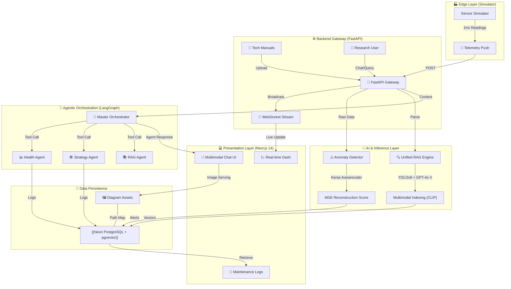
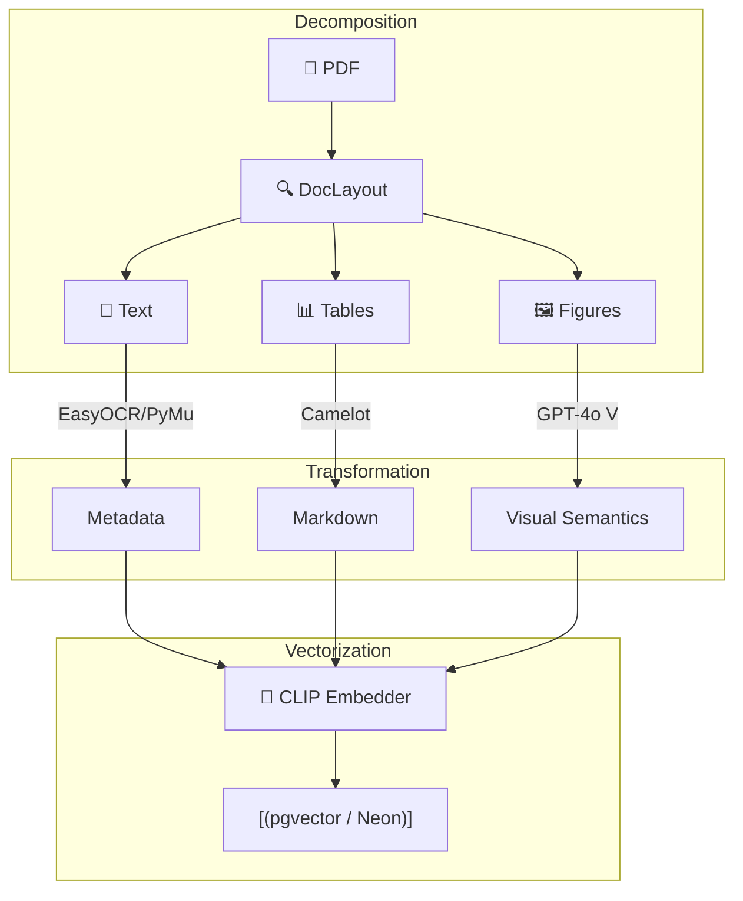

# 🏭 Industrial AI Copilot — System Launch Report (2026.03.22)

## 🌐 Unified System Architecture
Today marks the successful unification of the **Industrial AI Copilot** research framework. This system integrates high-frequency sensor telemetry, deep-learning based anomaly detection, and a state-of-the-art multimodal agentic RAG.

---

## 📚 Multimodal Document processing
The system utilizes a specialized pipeline to transform dense technical manuals into actionable intelligence.

### 🏗️ Ingestion & Retrieval Pipeline

---

## 🚀 Research Breakthroughs & Stability
To reach this "System Launch" state, several critical technical hurdles were overcome today:

### 1. Batch-Commit Ingestion Strategy
**Problem**: Large PDF manuals (100+ pages, 1000+ images) were causing SSL connection timeouts on Neon DB during long-running embedding/vision tasks.
**Solution**: Implemented a **Batch-Commit logic** that performs high-latency AI tasks (Vision API, CLIP locally) in isolation and only opens short-lived DB sessions to commit 50-chunk batches.
**Result**: Verified ingestion of a 98-page manual (1343 chunks) with zero failures.

### 2. Autoencoder Model Restoration
**Problem**: Missing `autoencoder.keras` weights caused 500 errors in the telemetry loop.
**Solution**: Re-initialized the entire ML pipeline:
1. `generate_dataset.py`: 20k row sensor baseline.
2. `normalization.py`: StandardScaler fitting.
3. `train_model.py`: Training to convergence (Epoch 100).
**Result**: Real-time anomaly detection is now live and pushing alerts via WebSockets.

### 3. Frontend Hydration & UI Stability
**Fixes**: Standardized chart heights and implemented mounting guards to prevent Recharts/Hydration mismatch errors in Next.js 14.

---

## 📅 Roadmap: Present State
- [x] **Unified Multimodal RAG**: Successfully ingesting text, complex tables, and technical figures.
- [x] **Real-time Anomaly Detection**: Fully trained model in telemetry loop.
- [x] **Agentic Orchestration**: LangGraph coordinates Health, Strategy, and Knowledge agents.
- [x] **Production Storage**: All vectors and relational logs persisted in Neon DB.

---
*Documented by Antigravity AI — Research & Development Branch*
