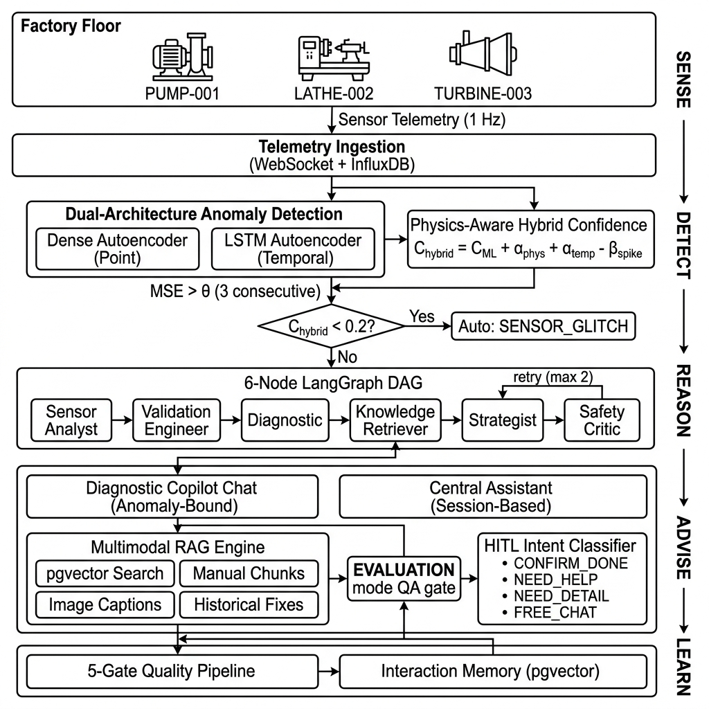
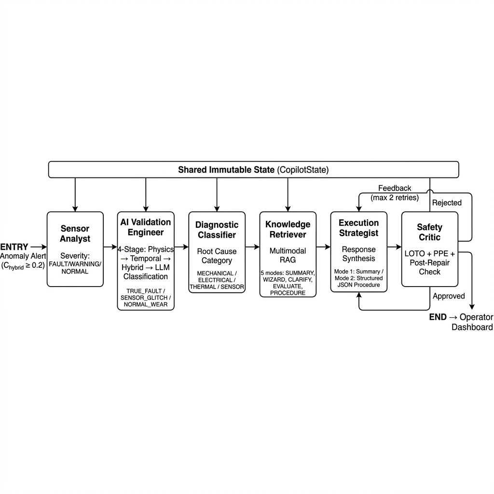
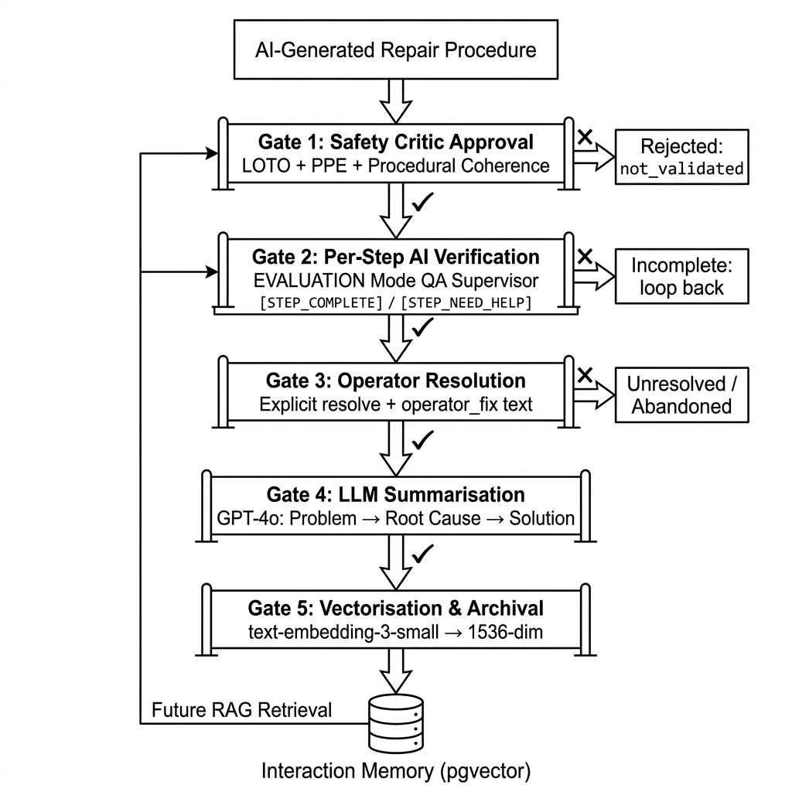

# III. METHODOLOGY
## Status: [✅] Done

---

The Zynaptrix Industrial Copilot implements a five-pillar operational intelligence methodology — **Sense → Detect → Reason → Advise → Learn** — realised as four tightly coupled subsystems: (A) a dual-architecture anomaly detection engine with physics-aware confidence scoring, (B) a six-node LangGraph multi-agent diagnostic pipeline, (C) a multimodal RAG engine with dual chatbot delivery, and (D) an incident-adaptive organisational memory. Fig. 1 presents the end-to-end system architecture.

## A. Physics-Aware Anomaly Detection

### 1) Dual-Architecture Autoencoder

The detection layer trains one dedicated model per registered machine asset. Two autoencoder architectures are supported and selected during machine onboarding based on sensor characteristics.

**Dense Autoencoder.** For point-in-time anomaly detection, a symmetric Dense autoencoder compresses a five-dimensional sensor vector x = [temperature, motor_current, vibration, speed, pressure] through layers of dimension 5 → 32 → 16 → 32 → 5 (ReLU activations; linear output). The model is trained exclusively on readings labelled `state == normal`, ensuring fault patterns — never seen during training — produce disproportionately high reconstruction error. Training uses the Adam optimiser with MSE loss over 50 epochs with a 10% validation split.

**LSTM Autoencoder.** For temporal drift detection — where individual readings appear normal but the trend is anomalous — an LSTM encoder–decoder operates on sliding windows of 10 consecutive readings (shape: 10 × 5). The encoder collapses the sequence through a 64-unit LSTM to a single context vector, which a RepeatVector layer expands back to the original sequence length, and a mirrored 64-unit LSTM decoder reconstructs the input via a TimeDistributed Dense layer.

Both models are normalised through a per-machine StandardScaler (Z-score transformation). At inference, the anomaly score is the mean squared reconstruction error:

$$\text{MSE}(x) = \frac{1}{d} \sum_{i=1}^{d} (x_i - \hat{x}_i)^2$$

where $d$ is the sensor dimensionality. A reading is classified anomalous when MSE exceeds a calibrated threshold (99th percentile of training MSE distribution). Health score is derived as $h = \max(0, 100 - \frac{\text{MSE}}{\theta} \times 100)$, yielding a human-interpretable 0–100 scale.

### 2) Consecutive-Count Escalation

Single-tick anomalies are suppressed as transient noise. The `AnomalyService` maintains a per-machine rolling counter; escalation to the agentic pipeline occurs only after three consecutive anomalous readings, filtering ephemeral sensor glitches and electrical interference events before they incur computational cost.

### 3) Hybrid Confidence Formula

Upon escalation, a hybrid confidence score fuses three orthogonal evidence channels into a single decision metric:

$$C_{\text{hybrid}} = C_{\text{ML}} + \alpha_{\text{phys}} + \alpha_{\text{temp}} - \beta_{\text{spike}}$$

where $C_{\text{ML}}$ is the normalised MSE score, $\alpha_{\text{phys}} \in \{0, 0.15, 0.3\}$ reflects the severity of physics-limit violations (none, warning, critical), $\alpha_{\text{temp}} = 0.2$ if temporal analysis confirms a sustained multi-reading trend, and $\beta_{\text{spike}} = 0.15$ penalises sudden single-reading spikes characteristic of EMI or ADC glitches. The result is clamped to $[0, 1]$. Anomalies with $C_{\text{hybrid}} < 0.2$ are auto-classified as `SENSOR_GLITCH` without engaging the LLM pipeline, directly reducing false-positive dispatch cost.

Physics-limit validation is performed against manufacturer-specified operational boundaries extracted from uploaded sensor datasheets during machine onboarding. For each sensor, the `SensorConfigLoader` maintains `min_normal`, `max_normal`, `fault_low`, and `fault_high` thresholds, enabling the hybrid formula to distinguish between readings that merely deviate from statistical norms and those that violate engineered physical constraints.

---

## B. Six-Node LangGraph Multi-Agent Pipeline

Anomalies surviving the hybrid confidence gate are routed to a six-node sequential DAG implemented in LangGraph [7], where each node is a specialised AI agent operating over a shared immutable state dictionary (`CopilotState`). The state flows linearly through the pipeline; each agent reads the accumulated context, computes its outputs, and appends new fields without modifying prior entries — ensuring full reproducibility and audit traceability.

### 1) Sensor Analyst

Translates raw sub-symbolic telemetry into a natural-language severity assessment. Receives the anomaly score, suspect sensor identifier, and recent multi-variate readings. Classifies severity as `FAULT` (MSE > 1.5× threshold), `WARNING`, or `NORMAL`, and generates a prose description of which sensors are deviating and the likely physical phenomena.

### 2) AI Validation Engineer

A four-stage neuro-symbolic validation node that represents the system's primary false-positive suppression mechanism:

- **Stage 1: Physics violations check** — evaluates every sensor reading against datasheet-derived limits, producing a structured violation summary distinguishing critical breaches from warnings.
- **Stage 2: Temporal pattern analysis** — the `TemporalAnalyzer` maintains a per-machine, per-sensor sliding history buffer (default: 5 readings) and computes moving-average deviation, rate-of-change, and directional trend (rising/falling/erratic/stable) to distinguish sustained degradation from transient spikes.
- **Stage 3: Hybrid confidence computation** — applies the formula of Section III-A.3 to aggregate all evidence channels.
- **Stage 4: High-accuracy LLM classification** — GPT-4o receives a structured prompt containing the physics summary, temporal pattern, cross-sensor readings, and hybrid confidence. Using few-shot engineering examples, it returns a JSON classification: `TRUE_FAULT`, `SENSOR_GLITCH`, or `NORMAL_WEAR`, plus a fault category (`mechanical`, `thermal`, `electrical`, `process`, `sensor`), a confidence score, and engineering notes with root cause hypothesis. Temperature is set to 0.1 for deterministic reproducibility.

If the AI Automation Engineer module is unavailable, the node gracefully degrades to a direct GPT-4o validation call with the same structured prompt, and ultimately to a default `TRUE_FAULT` classification preserving the conservative fail-safe posture.

### 3) Diagnostic Classifier

Consumes the Validation Engineer's output and maps the detected anomaly to a structured diagnostic category. For `TRUE_FAULT`, severity is escalated to `CRITICAL` (confidence ≥ 0.8) or `HIGH`. The diagnostic report, including the AI-generated root cause hypothesis, is persisted to the `anomaly_records` table for operator review and long-term analytics.

### 4) Knowledge Retriever

The RAG interface node. It dynamically resolves the machine's `manual_id` via the machine registry, performs a **provenance check** to verify manual content exists in the vector database, and executes the dual-source retrieval pipeline described in Section III-C. The node supports five RAG modes: `SUMMARY` (initial diagnostic brief), `CONVERSATIONAL_WIZARD` (step-by-step guided repair), `CLARIFICATION` (pointwise sub-step explanation), `EVALUATION` (operator progress assessment), and `PROCEDURE` (structured JSON output). The mode is selected automatically based on semantic markers in the operator's query (e.g., `[CONVERSATIONAL_WIZARD]`, `[CLARIFY_STEP]`).

### 5) Execution Strategist

Synthesises all upstream context — sensor analysis, diagnostic classification, retrieved manual knowledge, historical fixes, and technical diagram references — into a coherent operator-facing response. In `SUMMARY` mode, this is a concise diagnostic paragraph concluding with a `[SUGGESTION: Generate full step-by-step repair procedure]` tag that enables the operator to trigger guided repair. In `CONVERSATIONAL_WIZARD` mode, the Strategist produces a phased procedure with inline `[IMAGE_N]` tags interleaved at the exact procedural step where visual reference is most actionable.

### 6) Safety Critic

The terminal validation node enforcing industrial safety compliance. The Critic performs three mandatory checks: (i) Lockout/Tagout (LOTO) procedure presence for equipment requiring electrical isolation; (ii) PPE requirement specification; (iii) post-repair verification step inclusion. For structured procedures (Mode 2), the Critic additionally verifies that the first phase is typed `safety` and that critical tasks are marked `"critical": true`. If validation fails, the Critic injects structured feedback into the state and routes back to the Execution Strategist for refinement, bounded to a maximum of two retry iterations to prevent unbounded loops. Procedures failing both attempts are flagged `"not_validated"` and surfaced to the operator with an explicit manual-review advisory.

---

## C. Multimodal RAG Engine and Dual Chatbot Architecture

### 1) Ingestion Pipeline

Technical manuals are processed through a four-stage pipeline:

- **Stage 1: Layout Detection.** Each PDF page is rendered at 150 DPI via PyMuPDF and processed by a YOLOv8 model trained on the DocLayNet dataset, detecting six region classes: `picture`, `figure`, `text`, `title`, `list`, and `table`. Image regions are cropped and persisted as PNG files; text regions are extracted via coordinate-clipped OCR; tables are parsed through Camelot lattice detection.
- **Stage 2: Vision Captioning.** Each detected image region is submitted to GPT-4o Vision, which generates a detailed technical description prefixed with `[VISUAL DESCRIPTION]`. This caption — not the raw pixel data — becomes the searchable representation. This design decision is central: rather than embedding images directly via CLIP or ImageBind (which produce modality-aligned but semantically thin vector representations), the system converts visual content into domain-specific prose that occupies the same 1536-dimensional embedding space as textual chunks, enabling direct cross-modal retrieval without separate visual indices.
- **Stage 3: Contextual Chunking.** Text content is segmented using a sliding window of 500 words with 100-word overlap, preserving procedural continuity across chunk boundaries.
- **Stage 4: Embedding and Storage.** Each chunk (text, table, or image caption) is embedded via OpenAI `text-embedding-3-small` (1536 dimensions) and stored in a PostgreSQL table (`manual_chunks`) with pgvector extension, indexed by `manual_id` for asset-isolated retrieval.

### 2) Dual-Source Retrieval

The `RetrievalEngine` executes three parallel vector searches against a single query embedding:

| Search | Source Table | Filter | Top-K |
|--------|-------------|--------|-------|
| Text + Table chunks | `manual_chunks` | `manual_id` AND `type ∈ {text, table}` | 3 |
| Image caption chunks | `manual_chunks` | `manual_id` AND `type = image` | 3 (deduplicated by path) |
| Historical fixes | `interaction_memory` | `machine_id` | 2 |

This diversity allocation ensures every retrieval blend includes theoretical manual procedures, relevant engineering diagrams, and — when available — historically successful field repairs, providing the downstream LLM with a comprehensive evidence base.

### 3) Dual Chatbot Architecture

The system exposes two distinct conversational interfaces, each optimised for a different operational context:

**Diagnostic Copilot Chat** (`/api/copilot/invoke`). Anomaly-bound: each session is keyed to a specific `anomaly_id` and invokes the full six-node LangGraph pipeline. Messages are persisted in the `chat_messages` table with per-message metadata tracking operator intent. Operator free-text responses during guided repair are classified in real-time by a dedicated **Intent Classifier** endpoint (`/api/copilot/classify-intent`) that uses GPT-4o-mini (temperature = 0.0, deterministic) to map each message to one of four intents:

| Intent | Trigger Examples | System Action |
|--------|-----------------|---------------|
| `CONFIRM_DONE` | "done", "finished", "tightened it" | Trigger `EVALUATION` mode → AI verification before advancing |
| `NEED_HELP` | "stuck", "broken", "doesn't fit" | Trigger `CLARIFICATION` RAG mode |
| `NEED_DETAIL` | "how?", "explain", "show me" | Trigger `CLARIFICATION` RAG mode |
| `FREE_CHAT` | "what's the temperature limit?" | General RAG query within incident context |

This four-class intent classification enables the system to adaptively navigate the repair procedure based on the operator's actual situational state, rather than enforcing a rigid linear progression.

**Per-Step AI Verification (EVALUATION Mode).** Critically, operator step-completion claims are not taken at face value. When the intent classifier returns `CONFIRM_DONE`, the system does not immediately advance to the next step. Instead, the operator's feedback is routed through `EVALUATION` RAG mode, where GPT-4o assumes the role of a **Quality Assurance Supervisor**. This QA agent cross-references the operator's stated actions against the relevant manual content and returns one of two verdicts: `[STEP_COMPLETE]` — the claim is validated and the wizard advances — or `[STEP_NEED_HELP]` — the claim lacks sufficient evidence of correct execution, and the system loops back with targeted guidance. This per-step AI verification ensures that the repair procedure progresses only through confirmed-correct execution, preventing premature advancement that could leave safety-critical tasks unperformed.

**Central Assistant** (`/api/copilot/assistant`). A session-based, freeform knowledge assistant independent of any anomaly incident. The assistant maintains rolling 10-message conversational context and classifies each incoming query through a five-intent routing architecture:

- `GUIDE` — system navigation queries, resolved via structured step definitions without LLM invocation.
- `ONBOARDING` — platform feature questions, answered against an embedded system-knowledge prompt.
- `RAG` — technical maintenance questions with a machine selected, routed to the multimodal RAG engine with mode selection (`CONVERSATIONAL_WIZARD` for procedural queries, `SUMMARY` otherwise).
- `SEARCH` — general industrial knowledge queries, handled via GPT-4o synthesis.
- `CHAT` — conversational greetings and off-topic exchanges.

The assistant also provides **session export** and **AI-generated diagnostic report** capabilities, where GPT-4o extracts structured Problem → Diagnosis → Solution JSON from the full conversation history for documentation and audit purposes.

---

## D. Institutional Intelligence and Continuous Learning

### 1) Quality-Gated Incident Resolution and Memory Archival

Not all system outputs qualify for organisational memory. The archival pathway is protected by a **multi-gate quality control pipeline** ensuring that only validated, operator-confirmed resolutions enter the knowledge base:

- **Gate 1: Critic Approval.** Only procedures that have passed the Safety Critic's validation (Section III-B.6) — including LOTO, PPE, and procedural coherence checks — are surfaced to the operator. Unapproved or `"not_validated"` outputs never reach the HITL workflow and therefore cannot generate memory entries.
- **Gate 2: Per-Step AI Verification.** During the HITL repair wizard, every operator step-completion claim is validated by the EVALUATION mode QA Supervisor (Section III-C.3) before the wizard advances. An incident can only reach the resolution stage after every procedure step has been individually AI-verified as `[STEP_COMPLETE]`. This prevents partially completed or incorrectly executed repairs from generating memory entries.
- **Gate 3: Operator Resolution.** Memory archival is triggered exclusively when the operator explicitly resolves an incident through the HITL repair wizard, providing a free-text `operator_fix` description of the actual repair performed. Unresolved, abandoned, or escalated-to-manufacturer incidents are excluded from the memory pipeline — the system only learns from confirmed successful outcomes.
- **Gate 4: LLM Summarisation.** Upon resolution, GPT-4o receives the complete chat history concatenated with the operator's `operator_fix` narrative and generates a structured three-part summary (Problem, Root Cause, Solution). This step serves as both content normalisation and quality filtering: the LLM distils potentially verbose multi-turn conversations into concise, semantically dense representations suitable for future retrieval.
- **Gate 5: Vectorisation and Archival.** The validated summary is embedded via `text-embedding-3-small` and inserted into the `interaction_memory` table, tagged with the `machine_id` and timestamp. The `manual_id` field is set to `"Historical_Knowledge"`, distinguishing organisational memory from manufacturer documentation in the vector space.

This multi-gate architecture ensures that retrieval quality improves with scale rather than degrading through noise accumulation — a critical requirement for production deployments operating over months or years.

### 2) Memory Retrieval Strategy

During future incidents, the Knowledge Retriever node's dual-source search (Section III-C.2) automatically surfaces these quality-controlled historical fixes alongside manual content. Retrieval is filtered by `machine_id`, ensuring fleet-specific context affinity: memories from the same machine are prioritised, while semantically similar incidents from same-model equipment contribute fleet-wide pattern intelligence. Because only Critic-approved, step-verified, operator-resolved, and LLM-normalised memories exist in the vector space, the system maintains high retrieval precision as the memory corpus grows. As validated memories accumulate, the system progressively shifts from purely manual-grounded diagnosis to experience-augmented reasoning — without any model retraining, prompt modification, or manual curation.

### 3) Bidirectional Learning Channel

Critically, operator actions captured during the HITL wizard — step confirmations, "I'm stuck" escalations, deviation notes, and supplementary observations — are preserved in the `chat_messages` table and included in the GPT-4o summarisation input. This creates a bidirectional feedback loop: the AI informs the operator during an incident, and the operator's field observations improve AI responses for subsequent incidents on the same or similar equipment.

---
*Word count: ~1,850 words (IEEE compliant for Methodology — typically 1.5–2 pages in 2-column format)*

---

## References Used in This Section

| Tag | Full IEEE Citation |
|-----|---|
| [7] | LangChain, Inc., "LangGraph: Build Stateful, Multi-Actor Applications with LLMs," GitHub repository, 2024. [Online]. Available: https://github.com/langchain-ai/langgraph. [Accessed: Apr. 2026]. |
| [28] | J. Redmon *et al.*, "You Only Look Once: Unified, Real-Time Object Detection," in *Proc. IEEE CVPR*, pp. 779–788, 2016. |
| [29] | B. Pfitzmann, C. Auer, M. Dolfi, A. S. Nassar, and P. Staar, "DocLayNet: A Large Human-Annotated Dataset for Document-Layout Segmentation," in *Proc. ACM KDD*, pp. 3743–3751, 2022. |

