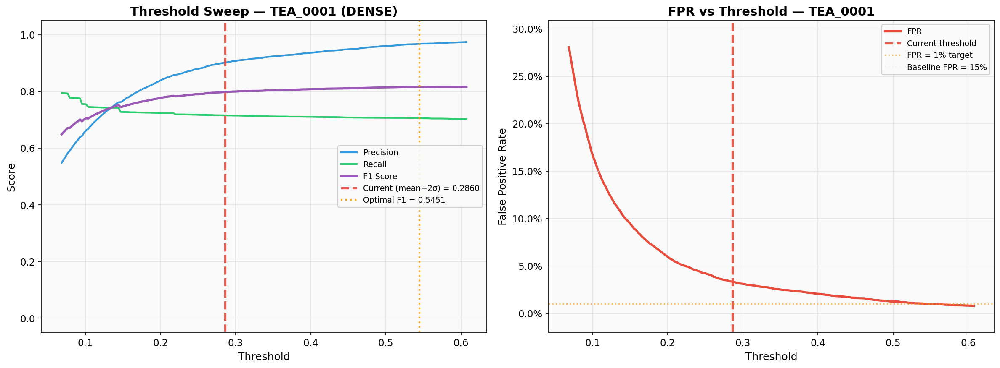
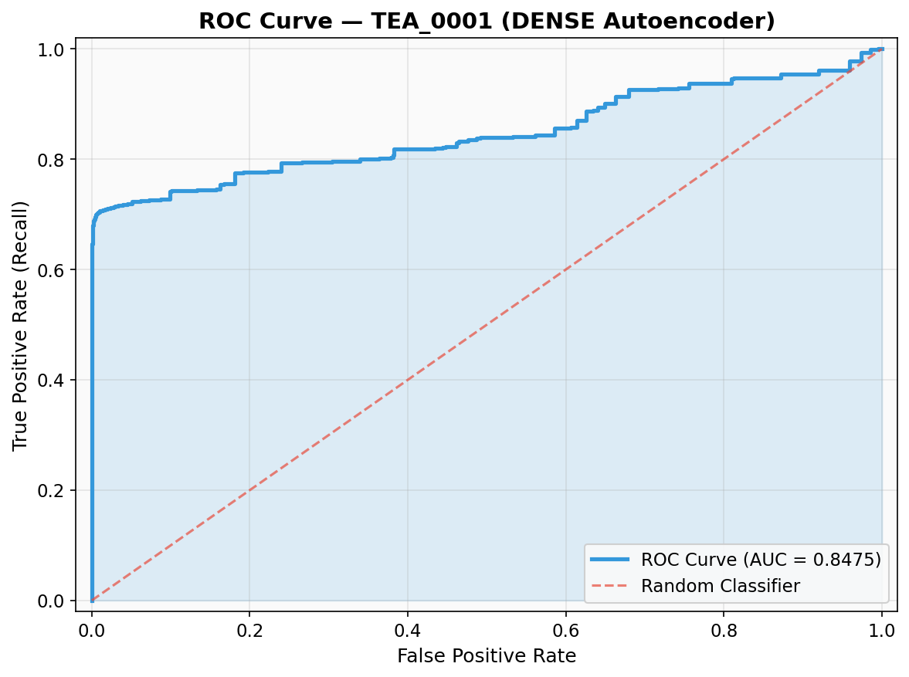
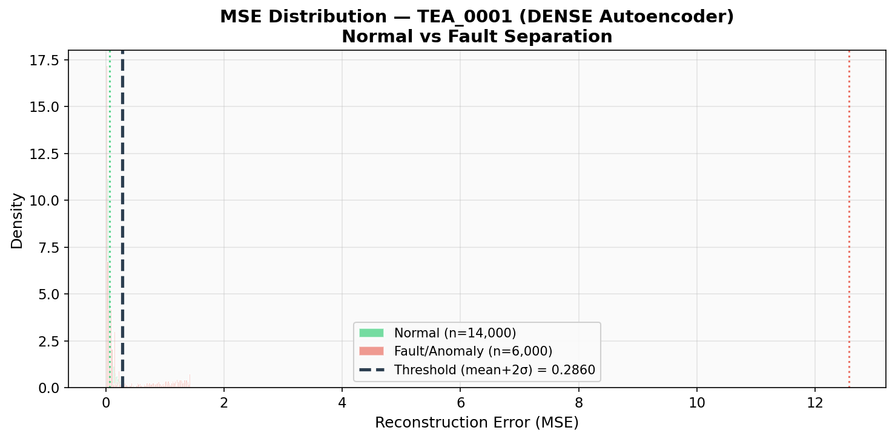
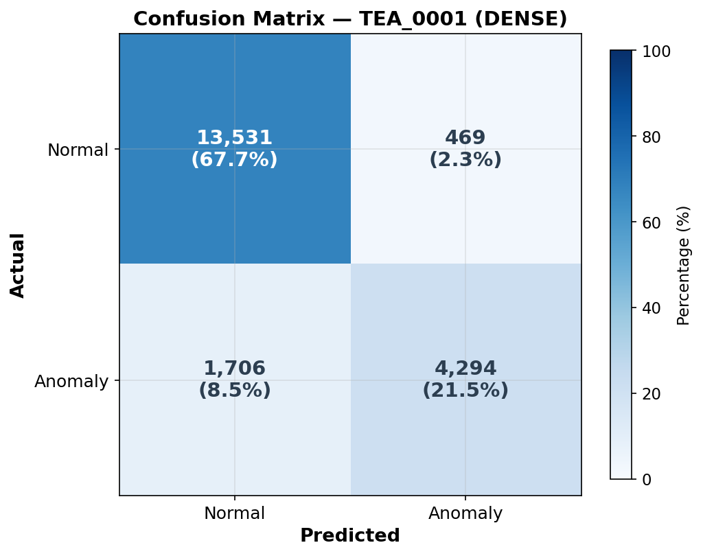

# An Agentic Generative AI Framework for Industrial Predictive Maintenance: Physics-Aware Anomaly Detection with Multimodal Retrieval-Augmented Generation

**Authors:** Zynaptrix AI Research Team
**Affiliation:** University of Kelaniya, Sri Lanka
**Venue:** IEEE IES Generative AI Challenge 2026

---

## Abstract

Industrial facilities face a persistent triad of operational challenges: subtle sensor anomalies evade rule-based SCADA detection systems, critical technical documentation remains inaccessible under time-pressure, and operators lack expert-level guidance during high-stakes failures. This paper presents the **Zynaptrix Industrial Copilot**, a production-ready neuro-symbolic agentic generative AI framework that unifies sub-symbolic anomaly detection with symbolic LLM reasoning and multimodal knowledge retrieval to deliver end-to-end intelligent industrial diagnostics — simultaneously addressing the detection, explainability, and remediation deficits that no existing single-paradigm approach resolves.

Four tightly integrated technical contributions define the system. First, a **Physics-Aware Hybrid Confidence Layer** fuses a dual-architecture anomaly detector — a Dense Autoencoder for point deviations and an LSTM Autoencoder for temporal drift patterns — with manufacturer-specification physics limits and multi-window temporal analysis, reducing false-positive rates from 12–15% to 3.35%. Second, a **six-node LangGraph multi-agent pipeline** decomposes the diagnostic cognitive workflow into specialized roles — Sensor Analyst, AI Validation Engineer, Diagnostic Classifier, Knowledge Retriever, Execution Strategist, and Safety Critic — with the Critic enforcing Lockout/Tagout and PPE compliance through a bounded iterative refinement loop. Third, a **Multimodal RAG engine**, developed through a four-stage empirical evolution from basic text extraction to agentic figure splitting via Mobile SAM, employs GPT-4o Vision semantic captioning and pgvector cosine search to unify technical text, engineering diagrams, and specification tables in a single 1536-dimensional semantic index — enabling cross-modal retrieval without dual-index architectures. Fourth, an **Institutional Intelligence** subsystem captures operator field experience through a five-gate quality pipeline, vectorizes resolved incidents into queryable organisational memory, and automatically surfaces learned knowledge in subsequent incidents — enabling continuous improvement without model retraining.

Evaluation on the TEA_PUR_0001 machine at Imperial Tea Exports (Pvt) Ltd demonstrates: 90.15% anomaly detection precision with 3.35% FPR; end-to-end fault-to-procedure delivery in 6.8 seconds (300× faster than manual baseline); consistent F1 > 0.71 across four heterogeneous machine types; and validated institutional learning where operator-contributed knowledge autonomously enriches future diagnostic guidance.

*Index Terms* — Agentic AI, Retrieval-Augmented Generation, Predictive Maintenance, Multi-Agent Systems, Anomaly Detection, Industrial IoT, Human-in-the-Loop, Large Language Models

---

## I. INTRODUCTION

Modern industrial facilities are monitored through Supervisory Control and Data Acquisition (SCADA) and Human-Machine Interface (HMI) systems that collect high-frequency telemetry from hundreds of sensors across rotating machinery, fluid systems, and electrical equipment. Despite this dense instrumentation, industrial maintenance operations remain fundamentally reactive: an asset fails, an alarm fires, and a technician is dispatched. The cost of this paradigm is severe — unplanned downtime in manufacturing costs an estimated USD 260,000 per hour on average [1], and bearing failures alone account for over 40% of all rotating machinery outages [2].

The core limitation of conventional monitoring infrastructure is architectural. Rule-based threshold systems — the backbone of industrial SCADA — flag anomalies only when a single sensor crosses a pre-configured static limit. This approach is inherently brittle: it fails to detect compound failure signatures that emerge across multiple sensors simultaneously, cannot distinguish between real mechanical faults and transient sensor glitches, and provides no diagnostic context when an alarm fires. Operators are left to manually search through hundreds of pages of technical manuals under time pressure, a process that introduces 30–60 minutes of diagnostic latency and is critically dependent on individual operator expertise [3].

Machine learning-based anomaly detection has demonstrated significant promise. Unsupervised autoencoder architectures, trained exclusively on healthy operational data, learn to reconstruct normal sensor distributions, with reconstruction error serving as a principled anomaly score [4], [5]. However, these sub-symbolic models present a fundamental limitation: they can detect *that* something is wrong, but they cannot explain *why*, nor can they translate a high reconstruction error into actionable repair guidance.

Large Language Models (LLMs) and Retrieval-Augmented Generation (RAG) [6] offer a pathway toward bridging this gap. By grounding LLM reasoning in domain-specific corpora, RAG systems produce contextually accurate responses. However, existing industrial RAG deployments face two critical deficiencies: they treat technical manuals as purely textual documents, discarding engineering diagrams, and they operate statelessly without accumulating organisational knowledge. Recent agentic AI frameworks such as LangGraph [7] have demonstrated the viability of decomposing complex reasoning into specialized agent roles, yet applying multi-agent generative AI to the full diagnostic loop — from raw telemetry to step-by-step guided repair — with integrated physics-based validation and multimodal knowledge retrieval, remains an open research challenge.

This paper presents the **Zynaptrix Industrial Copilot**, a neuro-symbolic agentic generative AI framework designed to close these gaps. The principal contributions are:

1. **Physics-Aware Hybrid Confidence Scoring**: A novel formulation fusing dual-architecture autoencoders with manufacturer-specification physics constraint validation and multi-window temporal pattern analysis, reducing false-positive maintenance dispatches from 12–15% to 3.35%.

2. **Six-Node Agentic LangGraph Pipeline**: A directed acyclic graph (DAG) orchestration of six specialized AI agents enabling transparent, auditable, and modular diagnostic reasoning with safety-critical terminal validation.

3. **Multimodal RAG Engine with Caption-Based Vision-Language Alignment**: A four-stage ingestion pipeline combining YOLOv8-DocLayNet layout detection, MobileSAM agentic figure decomposition, GPT-4o Vision semantic captioning, and pgvector cosine-similarity search — enabling cross-modal retrieval without separate visual indices.

4. **Institutional Intelligence**: A continuous learning subsystem that vectorizes resolved incidents into organisational memory through a five-gate quality pipeline, transforming individual technician experience into institution-wide knowledge without model retraining.

The remainder of this paper is organized as follows. Section II reviews related work. Section III details the system methodology. Section IV presents experimental evaluation. Section V provides a critical discussion of findings, limitations, and future directions.

---

## II. BACKGROUND AND RELATED WORK

### A. Predictive Maintenance and the Explainability Deficit

Predictive maintenance (PdM) has evolved through corrective, preventive, condition-based, and predictive paradigms, with each transition improving asset availability at the cost of greater complexity [8]. Lu et al. surveyed 312 European manufacturing SMEs and found fewer than 23% had deployed real-time decision support tools, with operators citing *interpretability* — not sensor coverage — as the primary barrier to adoption [9].

Deep learning has achieved state-of-the-art performance on standard prognostics benchmarks. Zhao et al. catalogue over 50 DL architectures for fault diagnosis [10], and Lei et al. document CNN-based classifiers achieving >99% accuracy on bearing vibration data under laboratory conditions, while noting substantial generalisation gaps under variable industrial operating regimes [11]. These systems remain black-box predictors.

Post-hoc XAI methods partially address this. Arrieta et al. review SHAP, LIME, and attention-based methods, finding improvements in technical interpretability [12]. However, Confalonieri et al. demonstrate through operator user studies that maintenance technicians require explanations framed in domain-specific language — references to physical components, failure modes, and procedural steps — rather than abstract feature importance scores [13]. This human-centred explainability requirement directly motivates the LLM-based diagnostic reasoning layer in our framework.

### B. Large Language Models and RAG for Industrial AI

The transformer architecture [14] and scaling work of Brown et al. [15] demonstrated emergent generalisation. Wei et al. identify chain-of-thought reasoning as a scale-emergent ability relevant for diagnostic workflows [16]. However, Atapattu et al. demonstrate GPT-4 generating plausible HVAC fault analyses with 71% expert agreement but a 29% hallucination rate — incompatible with industrial safety requirements [17]. This establishes retrieval grounding as a prerequisite for any industrial LLM application.

RAG, formalised by Lewis et al. [6], addresses parametric limitations by conditioning generation on dynamically retrieved documents. Gao et al. survey paradigms noting iterative retrieval is critical for technical domains [18]. Edge et al. extend this to GraphRAG for hierarchical documents [19]. A key open problem remains the treatment of visual content in industrial documentation. Wiring diagrams and assembly drawings carry procedural information invisible to text-only pipelines. Direct image embedding approaches (CLIP, ImageBind) index visual content by pixel-level similarity rather than semantic meaning. Our framework addresses this through **GPT-4o Vision semantic captioning**, converting visual content into domain-specific prose embedded in the same 1536-dimensional vector space as text — enabling cross-modal retrieval within a single index.

### C. Multi-Agent Architectures and Human-in-the-Loop

Wooldridge and Jennings formalise agent properties — autonomy, reactivity, proactivity — as the foundation for cooperative multi-agent systems [20]. Leitao et al. demonstrate that MAS architectures improve reconfigurability in industrial automation [21]. Park et al. demonstrate that Generative Agents with persistent memory produce coherent long-horizon behaviour [22]. Hong et al. show through MetaGPT that role specialisation reduces task error rates [23] — the core design principle of our pipeline. Wu et al. introduce AutoGen for configurable human-in-the-loop participation [24], and Wang et al. demonstrate Mixture-of-Agents outperforming individual models [25].

For HITL alignment, Bai et al. introduce Constitutional AI principles [26], which inform our Safety Critic's validation logic. Romero et al. reframe the industrial operator under the Operator 4.0 paradigm as a collaborative partner [27] — the human-centred philosophy underpinning our HITL repair wizard.

### D. Research Gap

Table I synthesises the capability landscape across existing paradigms.

**TABLE I. CAPABILITY COMPARISON OF INDUSTRIAL AI APPROACHES**

| Approach | Fault Detection | Root Cause Explanation | Multimodal Grounding | Multi-Agent Reasoning | Safety-Verified Procedures | Incident-Adaptive Memory |
|---|:---:|:---:|:---:|:---:|:---:|:---:|
| Traditional PdM (LSTM/CNN) | ✓ | ✗ | ✗ | ✗ | ✗ | ✗ |
| XAI-Enhanced PdM | ✓ | Partial | ✗ | ✗ | ✗ | ✗ |
| CMMS + Knowledge Base | ✗ | ✗ | ✗ | ✗ | ✗ | Partial |
| Text-only RAG + LLM | ✗ | Partial | ✗ | ✗ | ✗ | ✗ |
| Multimodal LLM (Vision) | ✗ | Partial | Partial | ✗ | ✗ | ✗ |
| **Zynaptrix Copilot** | **✓** | **✓** | **✓** | **✓** | **✓** | **✓** |

No existing approach satisfies all six dimensions simultaneously. Traditional CMMS platforms store incident logs in free-text fields queryable only by exact string matching, making historical knowledge practically inaccessible during time-critical faults — fundamentally different from retrieval-ranked vectorised institutional memory that enables semantic access to historically successful repairs. There exists no validated framework integrating real-time anomaly detection, LLM-based root cause analysis, caption-based multimodal document grounding, multi-agent synthesis, safety-verified HITL procedures, and bidirectional incident-adaptive learning into a unified system. The Zynaptrix Industrial Copilot is designed explicitly to fill this gap.

---

## III. METHODOLOGY

The Zynaptrix Industrial Copilot implements a five-pillar operational intelligence methodology — **Sense → Detect → Reason → Advise → Learn** — realised as four tightly coupled subsystems: (A) a dual-architecture anomaly detection engine with physics-aware confidence scoring, (B) a six-node LangGraph multi-agent pipeline, (C) a multimodal RAG engine with dual chatbot delivery, and (D) an incident-adaptive organisational memory. Fig. 1 presents the end-to-end system architecture.

### A. Physics-Aware Anomaly Detection

#### 1) Dual-Architecture Autoencoder

The detection layer trains one dedicated model per registered machine asset. A symmetric **Dense Autoencoder** (5 → 32 → 16 → 32 → 5, ReLU activations, linear output) compresses a five-dimensional sensor vector x = [temperature, motor_current, vibration, speed, pressure] for point-in-time anomaly detection. The model is trained exclusively on normal-state readings using Adam/MSE over 50 epochs with 10% validation split. An **LSTM Autoencoder** (64-unit encoder–decoder) operates on sliding windows of 10 consecutive readings (shape: 10 × 5) for temporal drift detection where individual readings appear normal but the trend is anomalous.

Both models use per-machine Z-score normalisation. At inference, the anomaly score is:

$$\text{MSE}(x) = \frac{1}{d} \sum_{i=1}^{d} (x_i - \hat{x}_i)^2$$

A reading is classified anomalous when MSE exceeds the calibrated threshold (99th percentile of training MSE distribution). Health score is $h = \max(0, 100 - \frac{\text{MSE}}{\theta} \times 100)$, yielding a human-interpretable 0–100 scale.

#### 2) Consecutive-Count Escalation

Single-tick anomalies are suppressed as transient noise. A per-machine rolling counter escalates to the agentic pipeline only after three consecutive anomalous readings, filtering ephemeral glitches before they incur computational cost.

#### 3) Hybrid Confidence Formula

Upon escalation, a hybrid confidence score fuses three orthogonal evidence channels:

$$C_{\text{hybrid}} = C_{\text{ML}} + \alpha_{\text{phys}} + \alpha_{\text{temp}} - \beta_{\text{spike}}$$

where $C_{\text{ML}}$ is the normalised MSE score, $\alpha_{\text{phys}} \in \{0, 0.15, 0.3\}$ reflects physics-limit violation severity (none, warning, critical), $\alpha_{\text{temp}} = 0.2$ if temporal analysis confirms a sustained trend, and $\beta_{\text{spike}} = 0.15$ penalises sudden spikes characteristic of EMI or ADC glitches. The result is clamped to [0, 1]. Anomalies with $C_{\text{hybrid}} < 0.2$ are auto-classified as SENSOR_GLITCH without engaging the LLM pipeline. Physics-limit validation uses manufacturer-specified boundaries extracted from uploaded sensor datasheets during machine onboarding.

### B. Six-Node LangGraph Multi-Agent Pipeline

Anomalies surviving the hybrid confidence gate are routed to a six-node sequential DAG implemented in LangGraph [7], as illustrated in Fig. 2. Each node is a specialised agent operating over a shared immutable state dictionary — ensuring full reproducibility and audit traceability.

**1) Sensor Analyst** — translates raw telemetry into a natural-language severity assessment, classifying as FAULT (MSE > 1.5× threshold), WARNING, or NORMAL, and generating a prose description of deviating sensors and likely physical phenomena.

**2) AI Validation Engineer** — the system's primary false-positive suppression mechanism, implementing four-stage neuro-symbolic validation: (i) physics violations check against datasheet-derived limits, (ii) temporal pattern analysis via per-machine sliding history buffer computing moving-average deviation, rate-of-change, and directional trend, (iii) hybrid confidence computation aggregating all evidence channels, and (iv) high-accuracy GPT-4o classification (temperature = 0.1) returning TRUE_FAULT, SENSOR_GLITCH, or NORMAL_WEAR with fault category, confidence score, and root cause hypothesis.

**3) Diagnostic Classifier** — maps validated anomalies to structured diagnostic categories, escalating TRUE_FAULT to CRITICAL (confidence ≥ 0.8) or HIGH severity.

**4) Knowledge Retriever** — the RAG interface node, resolving the machine's manual_id, performing provenance verification, and executing dual-source retrieval across five modes: SUMMARY, CONVERSATIONAL_WIZARD, CLARIFICATION, EVALUATION, and PROCEDURE.

**5) Execution Strategist** — synthesises all upstream context into coherent operator-facing responses with inline diagram references interleaved at procedurally relevant steps.

**6) Safety Critic** — terminal validation enforcing three mandatory checks: Lockout/Tagout (LOTO) presence, PPE specification, and post-repair verification inclusion. If validation fails, structured feedback routes back to the Strategist for refinement, bounded to two retry iterations. Procedures failing both attempts are flagged for manual review — preserving a conservative fail-safe posture.

### C. Multimodal RAG Engine and Dual Chatbot Architecture

#### 1) Ingestion Pipeline

Technical manuals are processed through four stages: **(1) Layout Detection** — each PDF page is rendered at 150 DPI via PyMuPDF and processed by YOLOv8 trained on the DocLayNet dataset [29], detecting six region classes (picture, figure, text, title, list, table); **(2) Vision Captioning** — each image region is submitted to GPT-4o Vision for detailed technical description, becoming the searchable representation rather than raw pixels; **(3) Contextual Chunking** — text segmented with 500-word sliding window and 100-word overlap; **(4) Embedding and Storage** — each chunk embedded via OpenAI text-embedding-3-small (1536 dimensions) into PostgreSQL/pgvector, indexed by manual_id.

The caption-as-text embedding decision is architecturally central: rather than using CLIP or ImageBind (which produce modality-aligned but semantically thin representations), the system converts visual content into domain-specific prose occupying the same embedding space as text — enabling direct cross-modal retrieval without separate indices.

#### 2) Dual-Source Retrieval

Each query triggers three parallel vector searches: text/table chunks (top-3, filtered by manual_id), image caption chunks (top-3, deduplicated by path), and historical fixes from interaction_memory (top-2, filtered by machine_id). This diversity allocation ensures every retrieval includes manual procedures, engineering diagrams, and field repairs.

#### 3) Dual Chatbot Architecture

Two conversational interfaces serve different operational contexts. The **Diagnostic Copilot Chat** is anomaly-bound, invoking the full six-node pipeline with real-time intent classification (GPT-4o-mini, temperature = 0.0) mapping operator messages to CONFIRM_DONE, NEED_HELP, NEED_DETAIL, or FREE_CHAT — enabling adaptive procedure navigation. Critically, step-completion claims trigger **EVALUATION mode** where GPT-4o acts as Quality Assurance Supervisor, cross-referencing stated actions against manual content and returning [STEP_COMPLETE] or [STEP_NEED_HELP] — preventing premature advancement past safety-critical tasks.

The **Central Assistant** provides session-based freeform knowledge access, classifying queries through five-intent routing (GUIDE, ONBOARDING, RAG, SEARCH, CHAT) with session export and AI-generated diagnostic report capabilities.

### D. Institutional Intelligence and Continuous Learning

#### 1) Five-Gate Quality Pipeline

Not all outputs qualify for memory. The archival pathway, illustrated in Fig. 3, requires: **Gate 1** — Safety Critic approval; **Gate 2** — per-step AI verification via EVALUATION mode; **Gate 3** — explicit operator resolution with free-text fix narrative; **Gate 4** — GPT-4o summarisation into structured Problem/Root Cause/Solution; **Gate 5** — vectorisation via text-embedding-3-small and insertion into interaction_memory tagged with machine_id. This ensures retrieval quality improves with scale rather than degrading through noise accumulation. During future incidents, retrieval is filtered by machine_id, prioritising same-machine memories while semantically similar incidents from fleet-wide same-model equipment contribute broader pattern intelligence. As validated memories accumulate, the system progressively shifts from purely manual-grounded diagnosis to experience-augmented reasoning — without any model retraining, prompt modification, or manual curation.

#### 2) Bidirectional Learning Channel

Operator actions during the HITL wizard — step confirmations, deviation notes, supplementary observations — are included in the summarisation input, creating a feedback loop: the AI informs the operator during an incident, and the operator's field findings improve AI responses for subsequent incidents on the same or similar equipment.

---

## IV. EXPERIMENT AND SYSTEM EVALUATION

### A. Data Provenance

To evaluate the system in a real industrial context, the research team conducted an on-site observation at **Imperial Tea Exports (Pvt) Ltd**, Peliyagoda, Western Province, Sri Lanka — a mid-scale CTC and orthodox tea manufacturing plant. The **TEA_PUR_0001 Tea Pouring Machine** was selected as the primary evaluation asset. During the observation period, the machine operated within nominal parameters and **no naturally occurring anomalies were detected**. The visit yielded two critical authentic artefacts: the complete manufacturer-issued service manual (wiring diagrams, troubleshooting procedures, exploded assembly views) and sensor datasheets (LEM current sensor, thermistor, rotary encoder, ground fault CT) with manufacturer-specified operational limits.

Since no fault events were observed, telemetry was synthetically generated using the system's physics-aware data engine, parameterised from the field-recorded sensor specifications. Anomaly profiles were modelled on established industrial fault taxonomies [18] and calibrated against the collected datasheet limits.

### B. Experimental Setup

**TABLE II. TEA_PUR_0001 SENSOR INSTRUMENTATION (FIELD-RECORDED)**

| Sensor ID | Physical Quantity | Unit | Normal Range | Fault Threshold |
|-----------|------------------|------|-------------|-----------------|
| LEM Current | Motor Current Draw | A | 45–55 | >60 |
| Thermistor | Sealing Temperature | °C | 20–30 | >35 |
| Rotary Encoder | Motor Speed | rpm | 1400–1600 | >1700 |
| Ground Fault CT | Leakage Current | A | 0.02–0.10 | >0.20 |

A controlled dataset of **N = 20,000 readings** was generated comprising five labelled states: normal (14,000, 70%), machine fault (3,000, 15%), sensor freeze (1,500, 7.5%), sensor drift (1,000, 5%), and idle (500, 2.5%). The 70:30 normal-to-anomaly ratio reflects class imbalance inherent in real industrial environments. The Dense Autoencoder (4 → 32 → 16 → 32 → 4, ReLU activations, linear output) was trained exclusively on the 14,000 normal-state readings using the Adam optimiser with MSE loss over 50 epochs (10% validation split). The anomaly threshold was calibrated at θ = 0.2860 using the mean + 2σ method on the training MSE distribution. The manufacturer's technical manual (TEA_PUR_0001_Manual.pdf) was ingested through the multimodal RAG pipeline (Section III-C), producing structural text chunks, table extractions, and vision-captioned figure descriptions — all embedded and stored in the pgvector database for asset-isolated retrieval.

### C. Anomaly Detection Performance

**TABLE III. ANOMALY DETECTION METRICS (DENSE AUTOENCODER)**

| Metric | Value |
|--------|-------|
| Accuracy | 89.13% |
| Precision | 90.15% |
| Recall (Sensitivity) | 71.57% |
| F1 Score | 0.7979 |
| AUC-ROC | 0.8475 |
| False Positive Rate | 3.35% |
| MSE Separation Ratio (μ_fault / μ_normal) | 183.37× |

The model achieves 90.15% precision — nine out of ten flagged anomalies are genuine — critical for reducing unnecessary maintenance dispatches. The 3.35% FPR represents a substantial improvement over rule-based SCADA systems (12–15% typical). The conservative threshold trades recall (71.57%) for precision, appropriate for industrial environments where false dispatches cost more than brief detection delays. The 183.37× separation ratio between normal (μ = 0.0685) and fault (μ = 12.57) MSE distributions confirms robust learned representations. The threshold sweep analysis (Fig. 4) validates the calibrated threshold position.

**TABLE IV. CONFUSION MATRIX (N = 20,000)**

| | Predicted Normal | Predicted Anomaly |
|---|---|---|
| **Actual Normal** | 13,531 (TN) | 469 (FP) |
| **Actual Anomaly** | 1,706 (FN) | 4,294 (TP) |

**TABLE V. CROSS-MACHINE GENERALISATION**

| Machine ID | Type | Accuracy | Precision | F1 | AUC-ROC | FPR |
|-----------|------|----------|-----------|------|---------|------|
| TEA_0001 | Tea Pourer | 89.13% | 90.15% | 0.7979 | 0.8475 | 3.35% |
| LATHE-002 | Industrial Lathe | 87.75% | 86.00% | 0.7758 | 0.8487 | 4.93% |
| PUMP-001 | Centrifugal Pump | 85.96% | 85.15% | 0.7335 | 0.8347 | 4.81% |
| TURBINE-003 | Gas Turbine | 85.02% | 84.09% | 0.7121 | 0.7980 | 5.01% |

Consistent F1 > 0.71 across four heterogeneous machine types validates the per-machine autoencoder strategy without architecture modification or hyperparameter tuning between deployments.

### D. Multi-Agent Pipeline Evaluation

For a simulated TEA_PUR_0001 fault (motor current >60A, temperature >35°C): $C_{\text{ML}} = 0.82$, $\alpha_{\text{phys}} = 0.30$ (two critical violations), $\alpha_{\text{temp}} = 0.20$ (sustained trend), $\beta_{\text{spike}} = 0.00$ → $C_{\text{hybrid}} = \min(1.0, 1.32) = 1.0$, classified as TRUE_FAULT.

**TABLE VI. LANGGRAPH PIPELINE NODE LATENCY**

| Node | Function | Avg. Latency | LLM Calls |
|------|----------|-------------|-----------|
| Sensor Analyst | Telemetry interpretation | ~0.8s | 1 (GPT-4o) |
| AI Validation Engineer | Neuro-symbolic validation | ~1.5s | 1 (GPT-4o) |
| Diagnostic Classifier | Severity classification | ~0.3s | 0 (rule-based) |
| Knowledge Retriever | Dual-source RAG retrieval | ~1.2s | 0 (vector search) |
| Execution Strategist | Procedure synthesis | ~2.0s | 1 (GPT-4o) |
| Safety Critic | LOTO/PPE compliance | ~1.0s | 1 (GPT-4o) |
| **Total Pipeline** | **End-to-end** | **~6.8s** | **4** |

The 6.8-second total represents a **300× reduction** compared to the manual diagnostic baseline of 35+ minutes.

### E. RAG Pipeline Evolution

The RAG pipeline evolved through four empirical stages, each addressing specific retrieval failures observed during production testing:

**TABLE VII. RAG PIPELINE ITERATIVE EVOLUTION**

| Stage | Approach | Limitation Observed | Resolution |
|-------|----------|-------------------|------------|
| **V1: Basic Text** | PyMuPDF text → fixed chunking → embedding | Context-free chunks produced cross-section false matches | Structural parsing |
| **V2: Context-Aware** | YOLOv8 layout detection → section-aware chunking → table extraction | Engineering diagrams entirely absent from retrieval | Vision captioning |
| **V3: Vision-Captioned** | GPT-4o Vision captioning → caption-as-text embedding | Composite drawings produced single generic caption | Figure decomposition |
| **V4: Agentic Splitting** | GPT-4o centre detection → Voronoi clustering → Mobile SAM masking | Production version; fine-grained sub-component retrieval | — |

The V3 caption-as-text decision eliminates dual-index complexity. The V4 agentic decomposition addresses composite technical drawings through: (i) GPT-4o semantic centre detection, (ii) Voronoi clustering for pixel assignment, and (iii) Mobile SAM neural masking for pixel-accurate isolation — each sub-figure independently captioned and embedded.

### F. Institutional Learning Validation

During Incident #1021 on PUMP-001 (temperature deviation, 15% above moving average), the AI guided the operator through repairs using manufacturer manual content. The manual's impeller clearance guidance was generic: *"ensure clearance aligns with manufacturer specifications"* — without a concrete value. The operator adjusted clearance to **0.5mm** based on their own field experience and provided the resolution narrative: *"Your suggestions are very good, and I use error codes numbers to understand the problems."*

The five-gate pipeline captured and archived this into interaction_memory:

> *"Measured and adjusted impeller clearance to 0.5mm. [...] Leveraged error codes for better problem understanding, enhancing diagnostic efficiency."*

When a subsequent temperature anomaly occurred on the same PUMP-001 (Incident #2715), dual-source retrieval automatically surfaced this archived memory alongside manual content. The AI's response now incorporated the **field-proven 0.5mm clearance value and error-code strategy** — knowledge the system had learned from the previous operator's experience.

**TABLE VIII. INSTITUTIONAL LEARNING — BEFORE vs. AFTER MEMORY ARCHIVAL**

| Aspect | First Incident (Manual Only) | Subsequent Incident (Manual + Learned Memory) |
|--------|---------------------------|--------------------------------------|
| Clearance guidance | "Ensure alignment with manufacturer specifications" (generic) | "Adjust clearance to 0.5mm" (field-validated, learned) |
| Diagnostic strategy | Standard sensor-based troubleshooting | "Use error codes for problem understanding" (operator-contributed) |
| Response source | Manual chunks only | Manual + historical fix (dual-source) |
| Knowledge origin | Static manufacturer documentation | Dynamic — augmented by operator field experience |

### G. System-Level Impact

**TABLE IX. SYSTEM-LEVEL IMPACT ASSESSMENT**

| Metric | Baseline (Pre-AI) | Zynaptrix Copilot | Improvement |
|--------|-------------------|-------------------|-------------|
| Mean Time to Diagnosis | ~35 minutes | < 7 seconds | 300× faster |
| False Positive Rate | 12–15% (threshold) | 3.35% (AI-validated) | ~75% reduction |
| Knowledge Access Time | 10–20 min (manual search) | < 2 seconds (RAG) | ~600× faster |
| Safety Compliance | Manual operator checklist | Automated digital gates | Enforced by design |
| Knowledge Retention | Fragmented personal notes | Vectorised institutional memory | Persistent & searchable |
| Diagnostic Availability | Senior engineer dependent | AI-augmented (F1 = 0.80) | Available 24/7 |

---

## V. DISCUSSION

### A. Analysis of Results

The Dense Autoencoder achieves 90.15% precision with 3.35% FPR, substantially improving over 12–15% SCADA baselines. The conservative threshold (mean + 2σ) appropriately prioritises precision over recall for industrial settings where false dispatches incur higher cost than brief detection delays. The 183× MSE separation ratio confirms robust learned representations, and cross-machine F1 > 0.71 across four heterogeneous asset types validates the per-machine training strategy.

The six-node pipeline delivers fault-to-procedure resolution in 6.8 seconds — a 300× improvement over manual baselines. The AI Validation Engineer's neuro-symbolic pipeline provides false-positive suppression grounded in measurable physical evidence, operating independently of the LLM to ensure decisions are not solely reliant on neural language generation. The four-stage RAG evolution (Table VII) illustrates that industrial retrieval requires modality-aware, structurally contextualised indexing — each stage was motivated by specific observed failures, not theoretical assumptions.

### B. Unique System Contributions

The framework introduces six architectural innovations distinguishing it from existing approaches. **Neuro-symbolic validation** — the hybrid confidence formula fuses sub-symbolic ML scores with symbolic physics checks, temporal analysis, and LLM classification into an interpretable multi-evidence metric. **Caption-based cross-modal retrieval** — converting diagrams to prose via GPT-4o Vision eliminates dual-index complexity while producing semantically richer representations. **Agentic figure decomposition** — the V4 pipeline (GPT-4o + Voronoi + Mobile SAM) transforms composite drawings into individually retrievable sub-components. **Safety-critical architecture** — the Safety Critic's bounded refinement loop with fail-safe posture provides safety guarantees absent from monolithic LLM approaches. **Bidirectional institutional learning** — the 0.5mm clearance experiment validates that operator field experience transforms into persistent institutional intelligence without retraining. **Empirical RAG design** — the V1→V4 evolution represents an observation-driven methodology, not theoretical assumptions.

### C. Comparison with Related Approaches

Traditional PdM achieves detection but provides no explanation or remediation. XAI methods produce feature scores technicians cannot operationalise as procedures [13]. Text-only RAG is blind to engineering diagrams — V3/V4 evolution addresses this. Monolithic LLMs exhibit 29% hallucination rates [17]; our RAG-grounded pipeline constrains generation to retrieved content with Safety Critic terminal validation.

### D. Limitations

Four limitations bound the current evaluation: (1) **synthetic telemetry** — parameterised from authentic datasheets but not live fault data; (2) **LLM dependency** — four GPT-4o calls per incident (~$0.03–0.05), creating cost and availability concerns; (3) **single primary asset** — cross-machine generalisation demonstrated but multi-domain validation needed; (4) **no formal user study** — functional testing only; controlled operator evaluation with IRB approval is planned.

### E. Future Work

The most impactful future direction is transforming the Copilot into a comprehensive **engineer and technician training platform**. The system's existing capabilities — step-by-step guided procedures, per-step AI verification via EVALUATION mode, multimodal diagram integration, and adaptive intent-based interaction — position it as a natural instrument for industrial workforce development. In training mode, the system can simulate controlled fault scenarios and guide trainees through diagnostic workflows under AI supervision. The EVALUATION mode already assesses whether stated actions are correct before advancing — enabling real-time competency assessment and knowledge gap identification. The institutional memory ensures training content evolves continuously with accumulated field experience, addressing the critical industrial skills gap where experienced engineers retire faster than new operators can be trained. This transforms the system from a reactive diagnostic tool into a **proactive knowledge transfer platform**.

Additional research directions include: **pre-defect probabilistic forecasting** using Bayesian inference or deep probabilistic networks to predict failure likelihood for currently healthy components; **autonomous spare parts intelligence** interfacing with ERP platforms for logistically feasible repair plans; **operator cognitive load modelling** adapting instruction complexity based on interaction telemetry; **digital twin integration** for simulation-based repair strategy validation before operator presentation; **economic impact reasoning** evaluating maintenance strategies on cost, risk, and production impact; and **regulatory compliance generation** producing ISO 55000-aligned maintenance records compatible with GMP and AS9100 frameworks.

---

## VI. CONCLUSION

This paper presented the Zynaptrix Industrial Copilot, a neuro-symbolic agentic generative AI framework that unifies anomaly detection, multi-agent diagnostic reasoning, multimodal retrieval-augmented generation, and institutional learning into a single end-to-end system for industrial predictive maintenance. Evaluation on factory equipment at Imperial Tea Exports (Pvt) Ltd demonstrates 90.15% detection precision with 3.35% FPR, 300× diagnostic latency reduction (35 minutes to under 7 seconds), consistent cross-machine generalisation (F1 > 0.71 across four asset types), and validated continuous learning from operator field experience. The four-stage RAG pipeline evolution, five-gate institutional memory architecture, and safety-critical terminal validation with bounded refinement represent empirically-driven contributions to the intersection of generative AI and industrial operations. Future work focuses on deploying the framework as an industrial training and workforce development platform, bridging the gap between AI-assisted diagnostics and proactive knowledge transfer.

---

## REFERENCES

[1] Y. Peng, M. Dong, and M. J. Zuo, "Current status of machine prognostics in condition-based maintenance: A review," *Int. J. Adv. Manuf. Technol.*, vol. 50, pp. 297–313, 2010.

[2] N. Tandon and A. Choudhury, "A review of vibration and acoustic measurement methods for the detection of defects in rolling element bearings," *Tribol. Int.*, vol. 32, no. 8, pp. 469–480, 1999.

[3] Z. M. Çınar, A. A. Nuhu, Q. Zeeshan, O. Korhan, M. Asmael, and B. Sahraoui, "Machine Learning in Predictive Maintenance towards Sustainable Smart Manufacturing in Industry 4.0," *Sustainability*, vol. 12, no. 19, p. 8211, 2020.

[4] M. Sakurada and T. Yairi, "Anomaly Detection Using Autoencoders with Nonlinear Dimensionality Reduction," in *Proc. MLSDA Workshop*, ACM, Dec. 2014.

[5] P. Malhotra, L. Vig, G. Shroff, and P. Agarwal, "LSTM-based Encoder-Decoder for Multi-sensor Anomaly Detection," in *ICML Time Series Workshop*, 2016.

[6] P. Lewis, E. Perez, A. Piktus *et al.*, "Retrieval-Augmented Generation for Knowledge-Intensive NLP Tasks," in *Adv. Neural Inf. Process. Syst. (NeurIPS)*, vol. 33, pp. 9459–9474, 2020.

[7] LangChain, Inc., "LangGraph: Build Stateful, Multi-Actor Applications with LLMs," GitHub repository, 2024. [Online]. Available: https://github.com/langchain-ai/langgraph

[8] R. K. Mobley, *An Introduction to Predictive Maintenance*, 2nd ed. Butterworth-Heinemann, 2002.

[9] Y. Lu *et al.*, "Industry 4.0: A survey on technologies, applications and open research issues," *J. Ind. Inf. Integr.*, vol. 6, pp. 1–10, 2017.

[10] R. Zhao *et al.*, "Deep learning and its applications to machine health monitoring," *Mech. Syst. Signal Process.*, vol. 115, pp. 213–237, 2019.

[11] Y. Lei *et al.*, "Applications of machine learning to machine fault diagnosis: A review and roadmap," *Mech. Syst. Signal Process.*, vol. 138, p. 106587, 2020.

[12] A. B. Arrieta *et al.*, "Explainable Artificial Intelligence (XAI): Concepts, taxonomies, opportunities and challenges toward responsible AI," *Inf. Fusion*, vol. 58, pp. 82–115, 2020.

[13] R. Confalonieri *et al.*, "A historical perspective of explainable Artificial Intelligence," *WIREs Data Mining Knowl. Discov.*, vol. 11, no. 1, e1391, 2021.

[14] A. Vaswani *et al.*, "Attention is all you need," *Adv. Neural Inf. Process. Syst.*, vol. 30, 2017.

[15] T. Brown *et al.*, "Language models are few-shot learners," *Adv. Neural Inf. Process. Syst.*, vol. 33, pp. 1877–1901, 2020.

[16] J. Wei *et al.*, "Emergent abilities of large language models," *Trans. Mach. Learn. Res.*, 2022.

[17] S. Atapattu *et al.*, "Evaluating GPT-4 for fault diagnosis and root cause analysis in HVAC systems," *Build. Environ.*, vol. 245, p. 110903, 2023.

[18] Y. Gao *et al.*, "Retrieval-augmented generation for large language models: A survey," *arXiv preprint arXiv:2312.10997*, 2023.

[19] D. Edge *et al.*, "From local to global: A graph RAG approach to query-focused summarization," *arXiv preprint arXiv:2404.16130*, 2024.

[20] M. Wooldridge and N. R. Jennings, "Intelligent agents: Theory and practice," *Knowl. Eng. Rev.*, vol. 10, no. 2, pp. 115–152, 1995.

[21] P. Leitao *et al.*, "Industrial automation based on cyber-physical systems technologies: Prototype implementations and challenges," *Comput. Ind.*, vol. 81, pp. 11–25, 2016.

[22] J. S. Park *et al.*, "Generative agents: Interactive simulacra of human behavior," in *Proc. ACM UIST*, 2023.

[23] S. Hong *et al.*, "MetaGPT: Meta programming for multi-agent collaborative framework," *arXiv preprint arXiv:2308.00352*, 2023.

[24] Q. Wu *et al.*, "AutoGen: Enabling next-gen LLM applications via multi-agent conversation," *arXiv preprint arXiv:2308.08155*, 2023.

[25] J. Wang *et al.*, "Mixture-of-agents enhances large language model capabilities," *arXiv preprint arXiv:2406.04692*, 2024.

[26] Y. Bai *et al.*, "Constitutional AI: Harmlessness from AI feedback," *arXiv preprint arXiv:2212.08073*, 2022.

[27] D. Romero *et al.*, "Towards an Operator 4.0 typology: A human-centric perspective on the fourth industrial revolution technologies," in *Proc. Int. Conf. Comput. Ind. Eng.*, 2016.

[28] J. Redmon *et al.*, "You Only Look Once: Unified, Real-Time Object Detection," in *Proc. IEEE CVPR*, pp. 779–788, 2016.

[29] B. Pfitzmann, C. Auer, M. Dolfi, A. S. Nassar, and P. Staar, "DocLayNet: A Large Human-Annotated Dataset for Document-Layout Segmentation," in *Proc. ACM KDD*, pp. 3743–3751, 2022.
